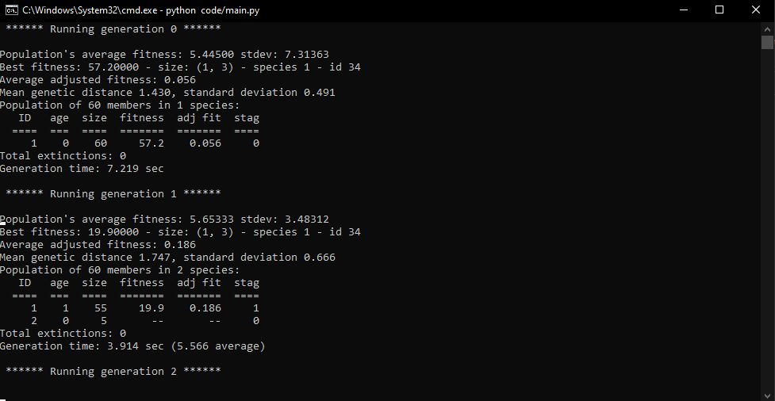

[![MIT License][license-shield]][license-url]

<!-- PROJECT LOGO -->
<br />
<p align="center">
  <a href="https://github.com/github_username/repo_name">
    
  </a>

  <h3 align="center">Flappy Birds AI</h3>

  <p align="center">
  Implementation of an AI using NEAT for Flappy Birds
  </p>
</p>


<!-- TABLE OF CONTENTS -->
<details open="open">
  <summary><h2 style="display: inline-block">Table of Contents</h2></summary>
  <ol>
    <li>
      <a href="#about-the-project">About The Project</a>
      <ul>
        <li><a href="#built-with">Built With</a></li>
      </ul>
    </li>
    <li>
      <a href="#getting-started">Getting Started</a>
      <ul>
        <li><a href="#prerequisites">Prerequisites</a></li>
        <li><a href="#installation">Installation</a></li>
      </ul>
    </li>
    <li><a href="#usage">Usage</a></li>
    <ul>
        <li><a href="#how-to-run">How to Run</a></li>
        <li><a href="#output-images">Output Images</a></li>
      </ul>
    <li><a href="#license">License</a></li>
  </ol>
</details>

<!-- ABOUT THE PROJECT -->
## About The Project

This is an implementation of an Artificial Intelligence for Flappy Birds game using NeuroEvolution of Augemented Topologies (NEAT) in python. Detailed explaination of NEAT and this AI can be found in **documentation/ai_project_report.pdf**.


### Built With

* [Python](https://www.python.org/)
* [NEAT Python](https://neat-python.readthedocs.io/en/latest/)
* [Py Game](https://www.pygame.org/)


<!-- GETTING STARTED -->
## Getting Started

To get a local copy up and running follow these simple steps.

### Prerequisites

* [Python3](https://www.python.org/downloads/)
* [git](https://git-scm.com)

### Installation

1. Clone the repo
   ```sh
   git clone https://github.com/saeenyoda/NEAT_Flappy_Birds.git
   ```


<!-- USAGE EXAMPLES -->
## Usage

### How to Run
1. Open up command line or terminal and navigate to the cloned repo's directory
   ```sh
   cd "PATH-TO-DIRECTORY"
   ```
2. Run the following command to install requirements
   ```sh
   pip3 install requirements.txt
   ```
3. Run main.py
   ```sh
   python3 code/main.py
   ```

***NOTE:***  
   &nbsp;&nbsp;&nbsp;&nbsp;&nbsp;&nbsp;`If you are using alias then python would work as well, otherwise python3 should be used.`

### Output Images
  
  
  
  
<!-- LICENSE -->
## License

Distributed under the MIT License. See `LICENSE` for more information.


<!-- MARKDOWN LINKS & IMAGES -->
<!-- https://www.markdownguide.org/basic-syntax/#reference-style-links -->
[license-shield]: https://img.shields.io/github/license/saeenyoda/Inverted_Indexing?label=license&style=for-the-badge
[license-url]: https://github.com/saeenyoda/Inverted_Indexing/blob/master/LICENSE
